# SEEFood

**SEEFood** is a modern Android application built with **Jetpack Compose**, **Firebase**, and **TheMealDB API** that helps you explore, search, and save your favorite meals with a seamless and beautiful UI.

---

## Features

- **Recipe Search**: Search meals by name or category
- **Explore Dishes**: Browse trending, popular, and random meals
- **Favorite Recipes**: Save meals to your Firebase Firestore account
- **Secure Login**: Firebase email/password authentication
- **Modern UI**: Fully built using Jetpack Compose and Material 3
- **Live API Integration**: Real-time meal data from TheMealDB

---

## Tech Stack

- **Language:** Kotlin  
- **UI Framework:** Jetpack Compose, Material 3  
- **Architecture:** MVVM  
- **Authentication:** Firebase Authentication  
- **Database:** Firebase Firestore  
- **Networking:** Ktor  
- **Image Loading:** Coil  
- **API:** [TheMealDB](https://www.themealdb.com/api.php)  
- **Dependency Injection:** Koin

---

## Screenshots
Below are screenshots showcasing the key features of SEEFood: 
### Login, Regester and Forget Password
Authentication flow using Firebase email/password system

  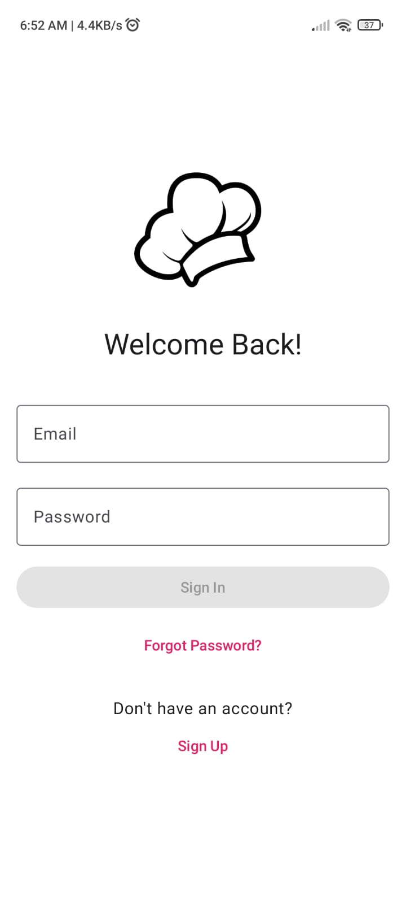
  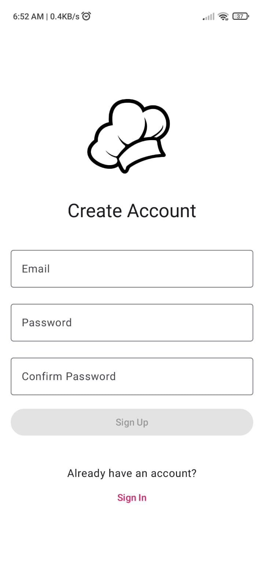
  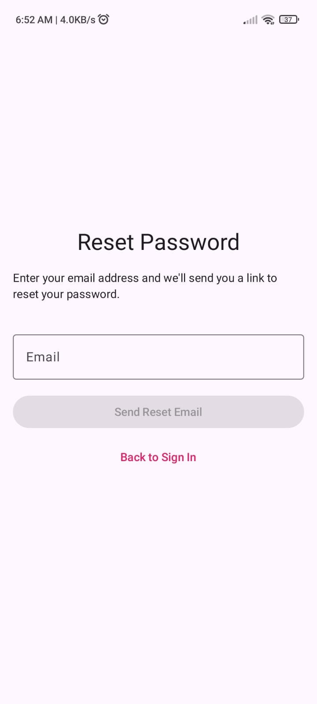

---

### Home Screen
Browse trending, popular, and category-based meals.

  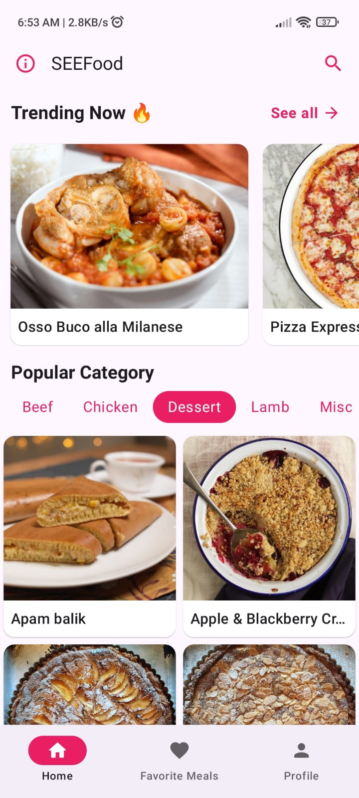
  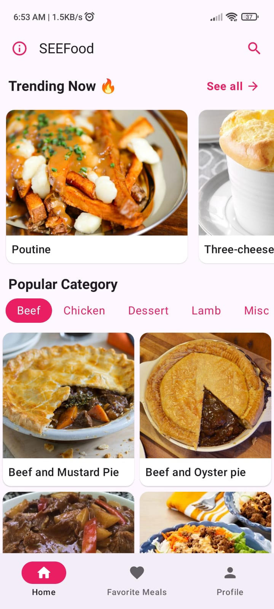
  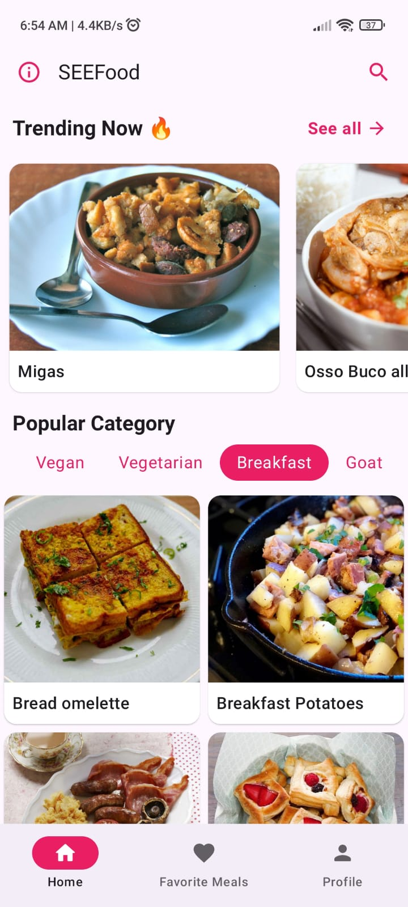

---

### Details, Search Screens
Detailed view of selected meals and real-time search by ingredients.

  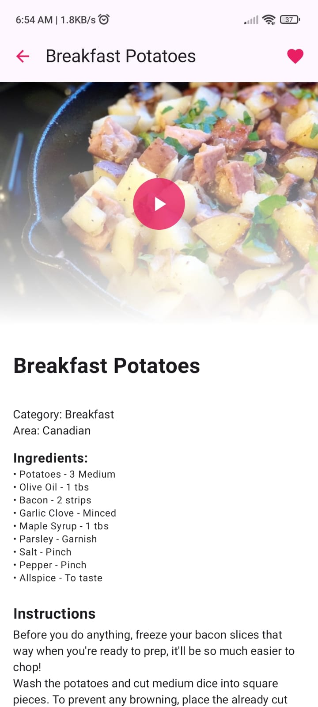
  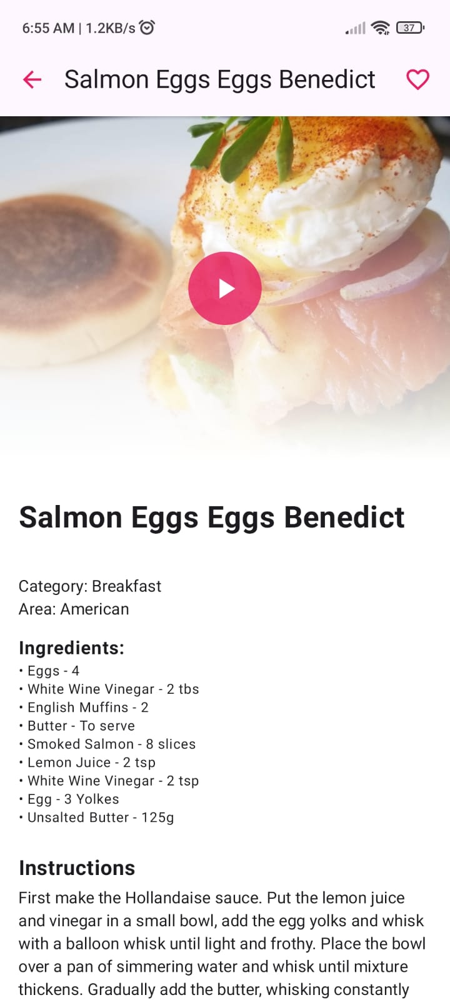
  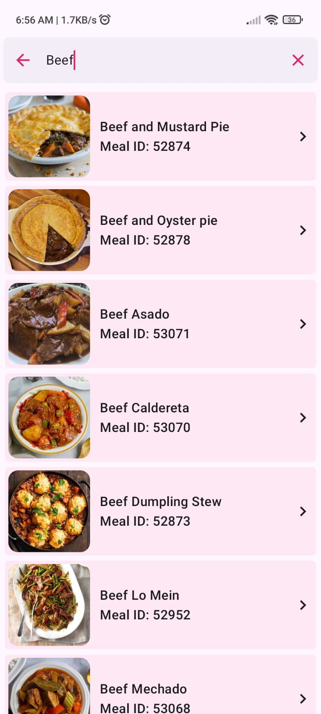

---

### Favorite, Profile, Error Screens 
Manage saved meals, view user info, and handle error states like no internet or no results.  

  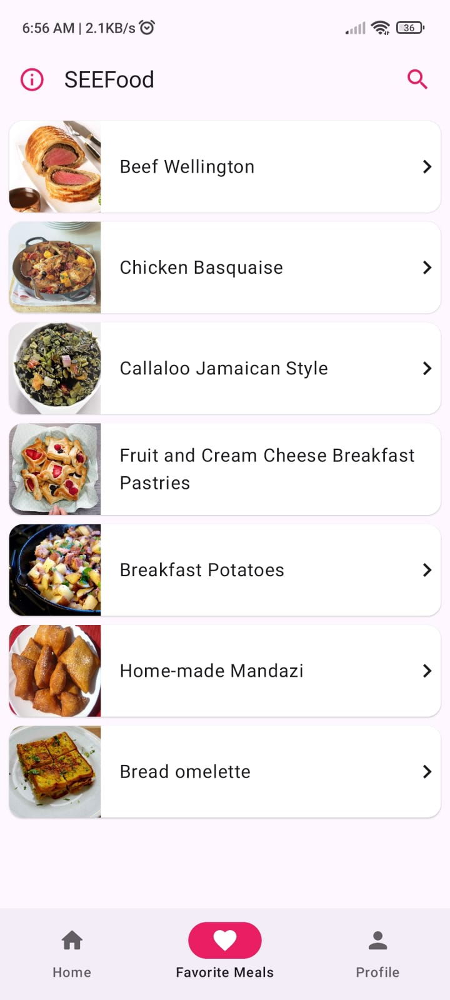
  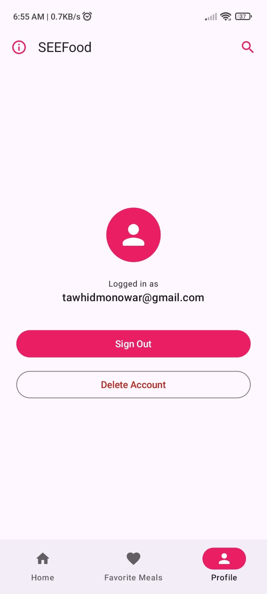
  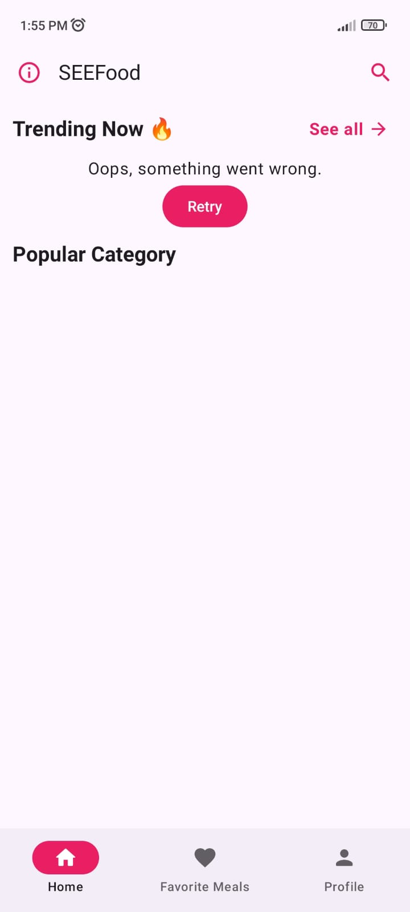

